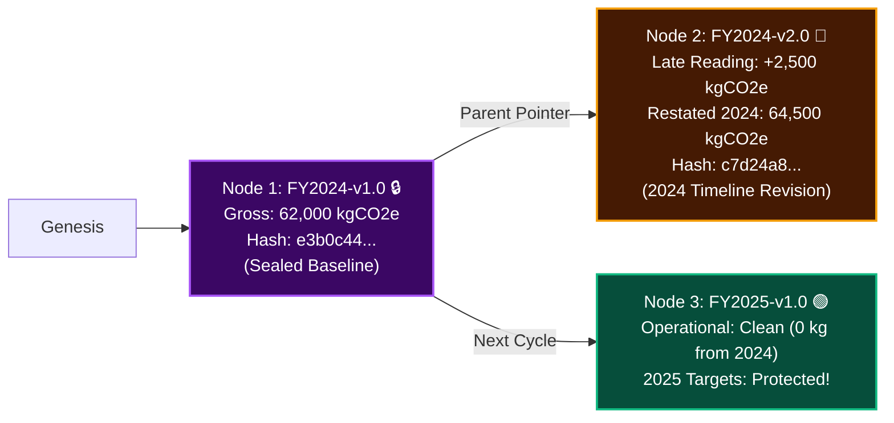

# 🌿 CarbonLedger

> **Emissions Accounting & Verifiable Carbon Ledger for a Multi-Plant Automotive Manufacturer**  
> *Course:* B.Tech CSE (2024-2028) · Semester V · **Software Engineering & Project Management (SEPM)**  
> *Case Study:* **No. 38 - CarbonLedger**

---

## 📌 Overview

**CarbonLedger** is an enterprise-grade emissions accounting and compliance software system designed for a Tier-1 automotive manufacturing group with **nine operational plants (P1-P9)**. The manufacturer must report verified carbon emissions across **three GHG Scopes** to its key customer (**BMW AG**) as an enforceable supply contract condition.

The core engineering challenge is **not calculation, but auditability**:
> *"A reported emissions figure must be reproducible byte-for-byte two years later from the identical inputs with identical emission factors, even though factor databases are revised annually by publishing authorities (EPA / DEFRA / IPCC)."*

See the raw unedited problem statement in [problem_statement.md](problem_statement.md).

---

## 🏗️ System Architecture & Core Concepts

### 1. "The Pair" Configuration Management Rule (FR-CM-01)
Emissions are calculated as a deterministic function:
$$\text{Emissions} = f(\text{Activity Data}, \text{Emission Factor})$$

To guarantee historical reproducibility, code and reference data are never versioned separately. They are cryptographically pinned as **"The Pair"**:
```
The Pair Baseline = (Calculation Engine Git SHA + Emission Factor Dataset Version)
Example: CL-2024.1 🔒 = (Engine Commit 9f2b8c4 + EPA/DEFRA 2024 v1.0)
```

### 2. Evidence Tiers & Honest Uncertainty Propagation (FR-UNC-01..05)
Data is categorized into four strict evidence tiers:

| Tier | Data Source | Uncertainty Margin ($u_i$) | Accounting Principle |
| :--- | :--- | :--- | :--- |
| **Tier 1: Metered** | IoT Sub-meters, Flow meters | $\pm 2\%$ | Physical measurement, highest quality |
| **Tier 2: Invoiced** | Utility bills, Diesel receipts | $\pm 8\%$ | Financial records, verified billing |
| **Tier 3: Estimated** | Declarations, Spend-based | $\pm 25\%$ | Proxy benchmarks, high variance |
| **Tier 4: Missing** | Unreported plant data | Disallowed at close | Flagged as blocking audit item |

#### Dual-Bound Uncertainty Disclosure:
Instead of reporting misleading single-point figures, CarbonLedger honestly brackets emissions between independent and correlated error models:
1. **Root-Sum-of-Squares Bound ($U_{\text{rss}}$):**
   $$U_{\text{rss}} = \sqrt{\sum_{i=1}^n (u_i \cdot E_i)^2}$$
2. **Conservative Linear Worst-Case Bound ($U_{\text{lin}}$):**
   $$U_{\text{lin}} = \sum_{i=1}^n |u_i \cdot E_i|$$

---

### 3. Git-Style Ledger DAG & Audit Diff Tree (FR-PC-06 & FR-LATE-01..05)
When a period (e.g., `FY2024`) closes, its root node is frozen. If late utility readings arrive post-freeze, CarbonLedger **does not pollute next year's targets**; it branches a verifiable child revision node on the same timeline:



---

## 📂 SEPM Project Deliverables

This repository contains all 6 formal course deliverables:

| Deliverable | File | Key Contents |
| :--- | :--- | :--- |
| **1. SRS Document** | [`01_SRS_CarbonLedger.pdf`](01_SRS_CarbonLedger.pdf) | IEEE 830 / ISO 29148 compliant. 18 Functional & 10 Non-Functional Requirements, MoSCoW prioritization, Temporal data rules. |
| **2. Decision Table & Test Set** | [`02_Decision_Table_and_Test_Set_CarbonLedger.pdf`](02_Decision_Table_and_Test_Set_CarbonLedger.pdf) | 48-rule combinatorial decision matrix, Equivalence Partitioning, Boundary Value Analysis, Pairwise tests. |
| **3. Design Pack** | [`03_Design_Pack_CarbonLedger.pdf`](03_Design_Pack_CarbonLedger.pdf) | C4 Architecture Model, PostgreSQL Temporal 2-Axis schema, UML Class & Reporting Activity diagrams, RFC 8785 Canonical JSON. |
| **4. Configuration Management** | [`04_Configuration_Management_Plan_CarbonLedger.pdf`](04_Configuration_Management_Plan_CarbonLedger.pdf) | Joint code/factor versioning ("The Pair"), 6 Formal Baselines (BL-1 to BL-6), Git branching strategy, CCB change control. |
| **5. Data Quality Plan (DQP)** | [`05_Data_Quality_Plan_CarbonLedger.pdf`](05_Data_Quality_Plan_CarbonLedger.pdf) | 3-Cycle Trajectory shifting Estimated data from 25% down to 5%, Zero-Capex 74% invoice capture rule, Plant-level KPIs. |
| **6. Project Plan** | [`06_Project_Plan_CarbonLedger.pdf`](06_Project_Plan_CarbonLedger.pdf) | 8 WBS Epics, 31 Work Packages, 10-Sprint Scrum Schedule aligned to contractual delivery, CPM Critical Path, Risk Matrix. |

---

## 💻 Interactive Web Application (`index.html`)

A full interactive single-page application is included in this repository:

```bash
# Simply open in any modern browser:
open index.html
```

### Features Implemented:
1. **📊 Portfolio Overview & Uncertainty:** Real-time dual-bound calculation ($U_{\text{rss}}$ vs $U_{\text{lin}}$) and 9-plant status grid.
2. **📝 Activity Data Intake:** Immutable append-only ledger with live evidence tier derivation (Metered / Invoiced / Estimated) and trigger simulation.
3. **⏱️ Period Close & DAG Branching:** State machine transitions (`OPEN` ➔ `CLOSED`), one-way freeze, late data simulator, and visual DAG version tree (`FY2024-v1.0` ➔ `FY2024-v2.0` ➔ `FY2025`).
4. **📑 Reports & Certs (BMW Issuance):** Official Luxury Compliance Certificate studio with one-click **Canonical JSON RFC 8785 download**, PDF print, and BMW API dispatch.
5. **🔍 Auditor Verify CLI:** Interactive terminal reproducing historical SHA-256 hashes with **1-byte database tamper detection simulation**.
6. **📈 3-Cycle Data Quality (DQP):** Visual trajectory tracker demonstrating 59% uncertainty reduction over 3 reporting cycles.

---

## 📜 Academic Reference
- **Name:**: Rohan Vashisht
- **Cohort:**: Jensen Huang
- **Roll No:**: 150096724132
- **Course:** B.Tech Computer Science & Engineering (2024-2028)
- **Subject:** Software Engineering & Project Management (Semester V)
- **Problem Statement:** Case Study No. 38 - CarbonLedger
- **Standards Applied:** IEEE 830, ISO/IEC/IEEE 29148, ISO 14064-1, GHG Protocol Corporate Standard, RFC 8785 (JCS).
